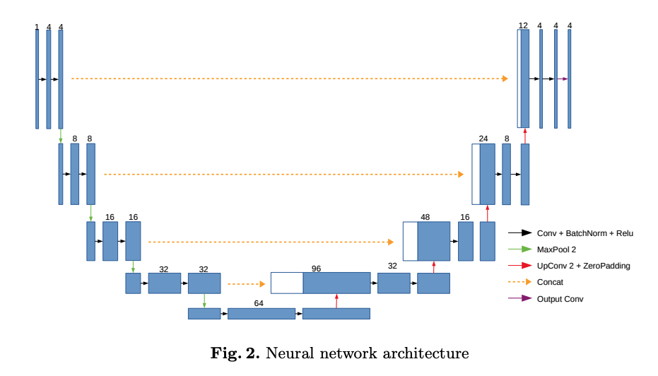
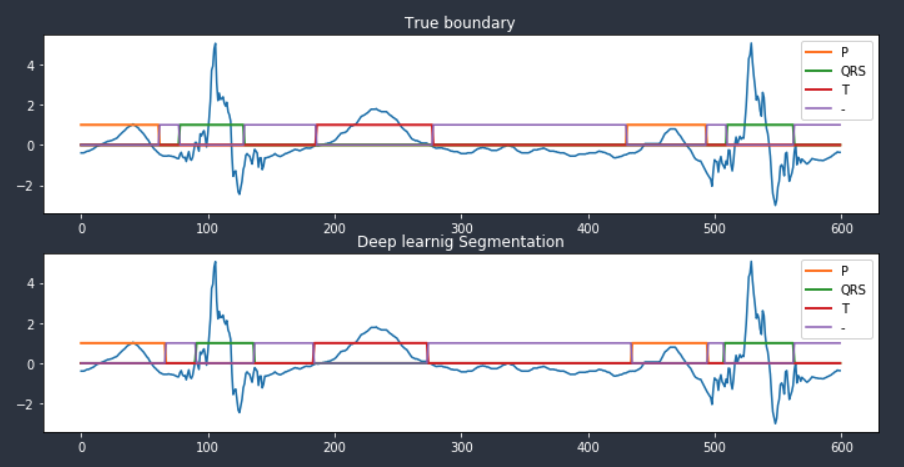
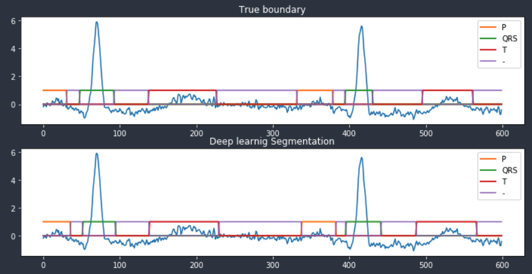
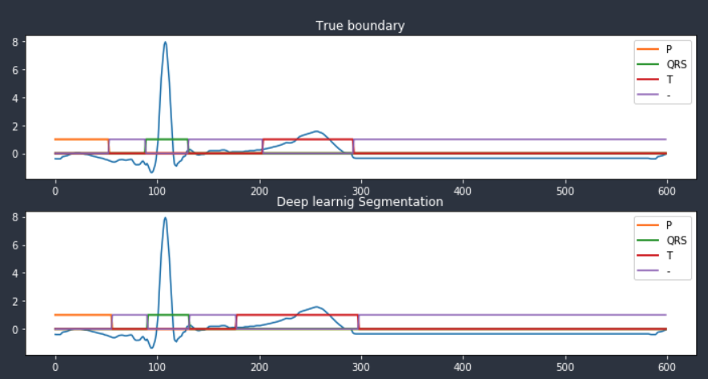
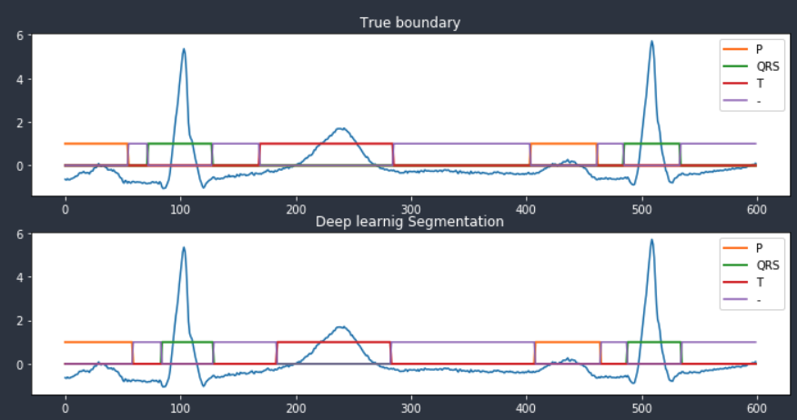

This is code for ECG segmentaion using 1 dimensional U-net    
I refered the paper "Deep Learning for ECG Segmentation"[[paper](https://arxiv.org/pdf/2001.04689.pdf)]    

Lobachevsky University Electrocardiography Database (LUDB) was used for ECG segmentaion task. [link](https://physionet.org/content/ludb/1.0.0/)

It contains 12 lead ECG data from 200 patients for 10 senconds. 
I preprocessed and extracted ECG segments and its code was included in notebook. 

In data folder, preprocessed files were contained. Rule of file name is "{ptient_id}_{segment number}.npz" I split train and test data by patients id. 

Segments model was one dimensional U-net (1D U-net). Model structure was same with the model suggested by the paper. 

The results of ECG segmenation

----------------------------------
Ajou University, Republic of Korea    
Computational Medical Intelligence (CMI) Lab    
E-mail : jangood1122@gmail.com